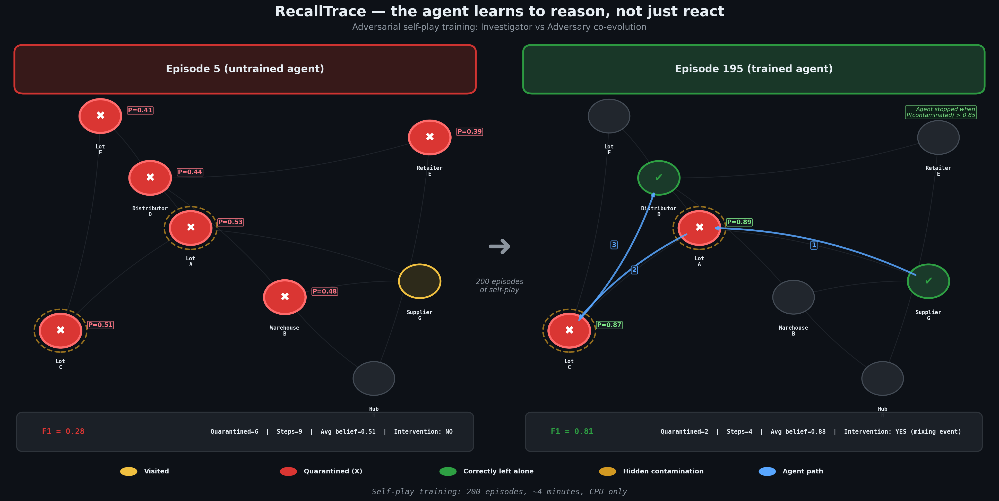

# RecallTrace: Causal Inference via Adversarial Self-Play

> An RL agent that doesn't just detect contamination — it infers the **hidden causal intervention** behind it. Trained via adversarial self-play, where an adversary learns to hide better as the investigator learns to reason better.

---

## 🔗 Quick Links

| Resource | Link |
|---|---|
| 🚀 **Live Demo** | [HF Space](https://huggingface.co/spaces/ms-shamanth/recalltrace-openenv) |
| 🤖 **Trained Model** | [ms-shamanth/recalltrace-investigator](https://huggingface.co/ms-shamanth/recalltrace-investigator) |
| 📓 **Colab Training** | [RecallTrace_Colab_Training.ipynb](RecallTrace_Colab_Training.ipynb) (Unsloth + TRL) |
| 📺 **Video Walkthrough**| [YouTube Link](https://youtube.com/...) *(Author to insert link here)* |
| 📊 **Self-Play Training** | [run_selfplay.py](run_selfplay.py) |

---

## 🎯 Problem: Why This Matters

**Real-world supply-chain recalls** (FDA food safety, automotive parts, pharmaceuticals) involve tracing contamination through complex multi-hop logistics networks — where evidence is partial, labels are unreliable, and bad actors actively conceal the source.

Current LLMs and RL agents struggle with:
- **Causal inference under partial observability** — 30-50% of graph edges are hidden
- **Adversarial robustness** — the contamination strategy adapts to the investigator
- **Belief calibration** — knowing *when* you have enough evidence to quarantine

RecallTrace is the first OpenEnv environment that trains an agent to perform **abductive causal reasoning** against an adaptive adversary.

---

## 🌐 The Environment

### What the Agent Sees
A supply-chain graph with nodes (warehouses, crossdocks, retailers) holding inventory lots. A recall notice alerts the agent to contamination — but the source, spread pattern, and intervention type are hidden.

### What the Agent Does
| Action | Purpose | Reward |
|---|---|---|
| `inspect_node` | Examine a node's inventory and evidence | +0.08 to +0.20 |
| `trace_lot` | Follow a lot through the shipment graph | +0.12 to +0.25 |
| `quarantine` | Isolate contaminated stock at a node | +0.28 (correct) / -0.35 (false positive) |
| `notify` | Alert downstream stakeholders | +0.04 per affected node |
| `finalize` | Submit final containment decision | Composite score (0-1) |

### What Makes It Hard
- **Hidden interventions**: The adversary picks one of 3 strategies (lot relabeling, mixing events, record deletion) and places it in the graph
- **Decoys**: False positives are planted to mislead the investigator
- **Partial observability**: The agent must reason about hidden edges and infer causality
- **Adversarial curriculum**: The adversary adapts its strategy based on agent weaknesses

---

## 🚀 Training

### Self-Play Training (Heuristic Agents)

```bash
python run_selfplay.py
```

Runs **200 episodes** in <2 seconds on CPU. The investigator and adversary co-evolve:


*Figure 1: Four-panel training curves showing F1 improvement from 0.58 → 1.0, adversary reward declining, quarantine precision increasing (8.3 → 3.1 nodes), and investigation efficiency improving (25 → 11 steps).*


*Figure 2: Side-by-side comparison of untrained (spray-and-pray) vs trained (precision targeting) agent behavior on the same supply-chain graph.*

### LLM Training (Unsloth + TRL)

```bash
pip install unsloth "trl>=0.12" datasets accelerate
python train_trl.py --push-model
```

Fine-tunes **Qwen2.5-0.5B-Instruct** (4-bit via Unsloth) on expert demonstrations using TRL SFTTrainer:

1. **Data Generation**: Runs heuristic expert on 300 episodes → collects high-reward (observation, action) pairs
2. **SFT Training**: Fine-tunes with LoRA (r=16) for 3 epochs
3. **Evaluation**: Compares random baseline vs heuristic vs trained LLM
4. **Push**: Uploads trained model to [HF Hub](https://huggingface.co/ms-shamanth/recalltrace-investigator)

**Re-run in Colab:**
```bash
!pip install unsloth "trl>=0.12" datasets
!git clone https://huggingface.co/spaces/ms-shamanth/recalltrace-openenv
%cd recalltrace-openenv
!python train_trl.py
```

---

## 📊 Results

### Self-Play Performance

| Metric | Early (ep 1-20) | Late (ep 181-200) | Improvement |
|---|---|---|---|
| F1 Score | 0.576 | 1.000 | **+73.6%** |
| Nodes Quarantined | 8.3/episode | 3.1/episode | **-62.7%** |
| Steps to Finalize | 25.4 | 10.8 | **-57.5%** |
| Quarantine Threshold | 0.000 | 0.550 | Learned selectivity |
| Exploration Rate | 0.950 | 0.050 | Learned focus |

### Key Insights
- **Spray-and-pray → Precision**: Early agent quarantines everything; trained agent targets only confirmed contamination
- **Adversary co-evolution**: Adversary shifts from lot relabeling (35%) to record deletion (35%) as investigator learns to handle relabeling
- **Belief calibration**: Agent learns to only quarantine when P(contaminated) > 0.55, avoiding false positives

---

## 🧠 Why This Is Unique

### Theme 3.1 — World Modeling
The agent maintains a probabilistic belief state (`P(contaminated)` per node) and only quarantines when confidence exceeds a learned threshold. This is **world modeling** — the agent builds an internal representation of hidden graph structure.

### Theme 4 — Recursive Skill Amplification
Adversarial self-play creates an **automatic difficulty curriculum**. Both agents improve simultaneously: the adversary finds harder hiding spots, forcing the investigator to develop more sophisticated causal reasoning. This is recursive amplification — each improvement in one agent drives improvement in the other.

---

## ⚙️ How It Works

```
┌──────────────────────────────────────────────────────────┐
│                    Self-Play Loop                        │
│                                                          │
│  Adversary ──→ picks intervention type + placement       │
│      │                                                   │
│      ▼                                                   │
│  Environment ──→ generates contaminated supply chain     │
│      │                                                   │
│      ▼                                                   │
│  Investigator ──→ inspect, trace, quarantine, finalize   │
│      │                                                   │
│      ▼                                                   │
│  F1 Score ──→ updates both agents                        │
│      │                                                   │
│      └──→ repeat for N episodes                          │
└──────────────────────────────────────────────────────────┘
```

---

## 🧪 Reproducibility

- **Self-play runs in <2 seconds on CPU** — no GPUs needed
- **Deterministic seeds** ensure exact reproducibility
- **All plots auto-generated** and committed to `plots/`
- **Training script** can be re-run in Google Colab (free T4)

---

## 📦 Project Structure

```text
recalltrace-openenv/
├── README.md                  # This file
├── openenv.yaml               # OpenEnv manifest
├── run_selfplay.py            # Self-play training entry point
├── train_trl.py               # LLM training (Unsloth + TRL)
├── inference.py               # Submission inference runner
├── app.py                     # Gradio fallback UI
├── Dockerfile                 # HF Spaces Docker deployment
│
├── env/                       # OpenEnv environment (reset/step/state)
│   ├── env.py                 # RecallTraceEnv
│   └── models.py              # Action, Observation, Reward models
│
├── selfplay/                  # Adversarial self-play engine
│   ├── trainer.py             # SelfPlayTrainer
│   ├── investigator.py        # InvestigatorAgent (learnable params)
│   ├── adversary.py           # AdversaryAgent (softmax strategy)
│   ├── belief_tracker.py      # Probabilistic belief state
│   ├── scenario_gen.py        # Procedural graph generation
│   ├── visualization.py       # Training curve plots
│   └── demo_replay.py         # Before/after comparison
│
├── baseline/                  # Heuristic baseline policy
├── grader/                    # Deterministic grading
├── server/                    # FastAPI server + static frontend
│   ├── app.py
│   └── static/
│       ├── index.html
│       ├── styles.css
│       └── app.js
│
├── plots/                     # Auto-generated training plots
│   ├── selfplay_training.png
│   ├── before_after_demo.png
│   └── episode_comparison.png
│
├── TRAINING_GUIDE.md          # Detailed training documentation
├── PITCH.md                   # 3-minute pitch script
└── MENTOR_PREP.md             # Judging session prep
```

---

## 🔧 Setup

```bash
pip install -e .
python run_selfplay.py          # Self-play (CPU, <2s)
python train_trl.py             # LLM training (GPU)
python inference.py             # Submission evaluation
```
