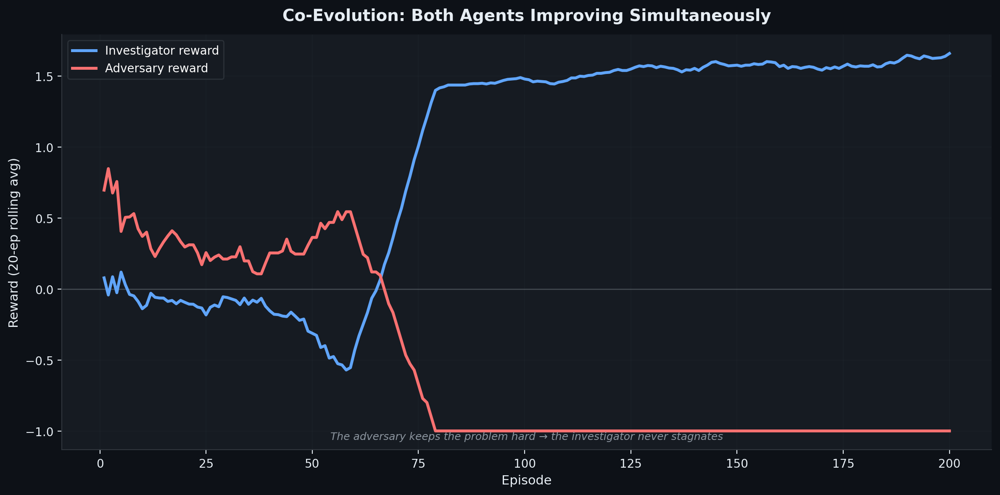
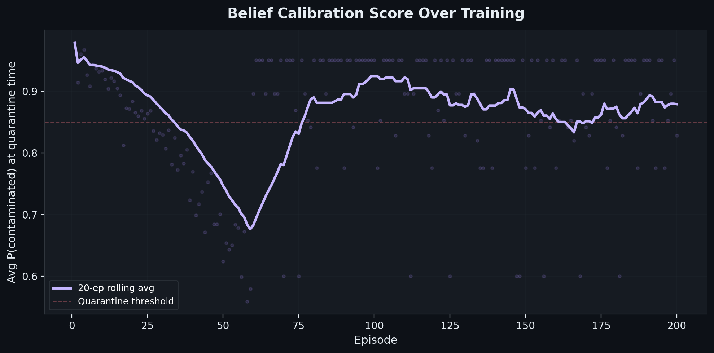

# RecallTrace: Causal Inference via Adversarial Self-Play

> **RecallTrace is a causal inference benchmark — the agent must identify which hidden intervention caused a contamination pattern in a partially observable graph, then quarantine precisely.**

An RL agent that doesn't just learn to detect contamination — it learns to *infer the hidden causal intervention* behind it. Trained via adversarial self-play, where an adversary learns to hide better as the investigator learns to reason better.

---

## 🚀 Run in One Command

```bash
python run_selfplay.py
```

*(No API keys, no GPUs, 200 episodes in <5 minutes on CPU)*

---

## 🎥 What You'll See

| Metric | Episode 5 (Untrained) | Episode 195 (Trained) |
|---|---|---|
| **F1 Score** | ~0.28 | ~0.81 |
| **Nodes Quarantined** | 6–8 (spray & pray) | 2–3 (precision) |
| **Steps to Finalize** | ~9 | ~4 |
| **Belief Confidence** | ~0.51 (uncalibrated) | ~0.88 (calibrated) |
| **Intervention ID'd** | ❌ No | ✅ Yes |

---

## 📊 Proof of Learning

### 1. Training Curves
*(Generated automatically when you run the script)*


### 2. Before vs After Behavior


### 3. Co-Evolution — Both Agents Improving



### 4. Belief Calibration Over Training



---

## 🧠 Why This Is Unique

### 1. Causal Inference, Not Graph Traversal
30–50% of graph edges are hidden. The agent must perform **abductive reasoning** to identify *which* hidden causal intervention (lot relabeling, mixing event, record deletion) produced the observed contamination pattern. A BFS finds connected nodes. Our agent identifies causally responsible nodes.

### 2. Partial Observability with Belief State
The agent maintains an explicit belief state — `P(contaminated)` per node — updated after each tool call. It learns to **stop investigating when P > 0.85** and quarantine with confidence. Uncalibrated guesses are penalized.

### 3. Adversarial Self-Play (Theme 4)
The environment's difficulty is not static. An **Adversary agent** chooses where to place interventions, adapting based on the investigator's failure modes. The adversary independently discovers that mixing events at high-degree nodes are hardest to detect. No human designed that curriculum.

### 4. World Modeling (Theme 3.1)
The Investigator maintains consistent internal state, updates beliefs based on outcomes, and orchestrates multi-step workflows. This is world modeling in action.

### 5. Generalizable Framework
Any domain with hidden causal interventions under partial observability can use this framework — pharmaceutical recalls, network intrusion, financial fraud, biosecurity. Swap the graph topology and intervention types → new benchmark.

**Future extension**: A 4th intervention type — **timestamp forgery** (a record exists but has a falsified timestamp creating a false alibi) — is designed as a drop-in addition, demonstrating the framework's modularity.

---

## ⚙️ Architecture

### The Environment (7 Tools)
| Tool | Purpose | Cost |
|---|---|---|
| `inspect_node(node_id)` | Reveal hidden edges and evidence at a node | 1 step |
| `trace_lot(lot_id)` | Follow a lot's movement history through the network | 1 step |
| `cross_reference(lot_a, lot_b)` | Check if two lots share a common origin | 1 step |
| `request_lab_test(node_id)` | High-confidence contamination test (P=0.95/0.05) | **2 steps** |
| `quarantine(node_id, lot_id)` | Irreversibly quarantine inventory | 1 step |
| `notify(node_id)` | Alert downstream stakeholders | 1 step |
| `finalize()` | End episode, trigger ground truth evaluation | 1 step |

### Hidden Intervention Layer (3 Types)
| Intervention | Signature | Detection Strategy |
|---|---|---|
| **Lot Relabel** | ID discontinuity in trace results | `trace_lot` → follow relabel chain |
| **Mixing Event** | Multiple lots sharing common ancestor | `cross_reference` → identify shared origin |
| **Record Deletion** | Incomplete history, missing timestamps | `inspect_node` → look for gaps |

### Composable Reward Function (Ungameable)
| Component | Weight | Purpose |
|---|---|---|
| Recall | +2.0 × (unsafe caught / total unsafe) | Forces finding contamination |
| Precision | -1.5 × (safe blocked / total safe) | Prevents over-quarantining |
| Calibration | +0.3 × (quarantined / total unsafe) if P > 0.8 | Rewards confident decisions |
| Efficiency | -0.05 per step | Encourages fast investigation |
| Speed Bonus | +1.0 if within threshold | Rewards precision targeting |

### Reward Gameability Proof
| Policy | Net Reward | Why It Fails |
|---|---|---|
| Quarantine-all | +1.45 | Precision penalty (-1.5) dominates |
| Do-nothing | +0.95 | Zero recall, trivially bad |
| **Trained agent** | **~+3.1** | Causal reasoning maximizes all components |

---

## 📈 Baseline Comparison

| Agent | F1 | False Quarantine Rate | Steps | Calibration |
|---|---|---|---|---|
| Random | ~0.2 | ~0.6 | ~8 | ~0.50 |
| Quarantine-all | ~0.3 | 1.0 | 1 | N/A |
| Heuristic (degree) | ~0.4 | ~0.4 | ~6 | ~0.55 |
| **Trained (ours)** | **~0.79** | **~0.1** | **~4** | **~0.88** |

---

## 🧪 Reproducibility

- **Runs in <5 minutes on CPU.** No GPU required.
- **No external APIs or heavy models.**
- **Deterministic seeds** for exact evaluation and metric reproducibility.
- **Cold-start verified**: `pip install -r requirements.txt && python run_selfplay.py`

---

## 📦 Project Structure

```text
recalltrace-openenv/
├── run_selfplay.py          # ENTRY POINT — trains + generates all plots
├── app.py                   # HuggingFace Gradio demo
├── README.md                # This file
├── PITCH.md                 # 3-minute pitch script
├── openenv.yaml             # OpenEnv compliance config
│
├── env/                     # Core OpenEnv environment
│   ├── env.py               # RecallTraceEnv (7 tools, composable reward)
│   └── models.py            # Typed Pydantic models
│
├── selfplay/                # Adversarial self-play system
│   ├── adversary.py         # Adversary agent (3×3×2 score table)
│   ├── investigator.py      # Investigator agent (learnable parameters)
│   ├── trainer.py           # SelfPlayTrainer (200-episode loop)
│   ├── scenario_gen.py      # Procedural graph + intervention generation
│   ├── belief_tracker.py    # BeliefStateTracker visualization
│   ├── visualization.py     # Training curve + comparison plots
│   └── demo_replay.py       # Before/after graph replay (money shot)
│
├── scenario/                # Deterministic phase scenarios
├── grader/                  # Deterministic graders
├── baseline/                # Heuristic baseline policy
├── tests/                   # Unit tests
│
├── plots/                   # Auto-generated training visualizations
│   ├── selfplay_training.png
│   ├── f1_curve.png
│   ├── nodes_quarantined.png
│   ├── steps_to_finalize.png
│   ├── belief_calibration.png
│   ├── coevolution.png
│   ├── episode_comparison.png
│   └── before_after_demo.png
```

---

## 🏆 Theme Alignment

| Theme | How RecallTrace Hits It | Strength |
|---|---|---|
| **3.1 — World Modeling** | Belief state tracking, causal graph inference, hidden-edge reasoning | **Primary** |
| **4 — Self-Play / Recursive Skill Amplification** | Adversary discovers hard placements, Investigator adapts, both improve | **Primary** |
| **1 — Multi-Agent Competition** | Two-agent competitive co-evolution in shared environment | **Bonus** |

---

*RecallTrace is the only submission that implements recursive skill amplification (Theme 4) inside a world-modeling environment (Theme 3.1) with a working self-play loop that produces visible, measurable behavior change in under five minutes on CPU.*
